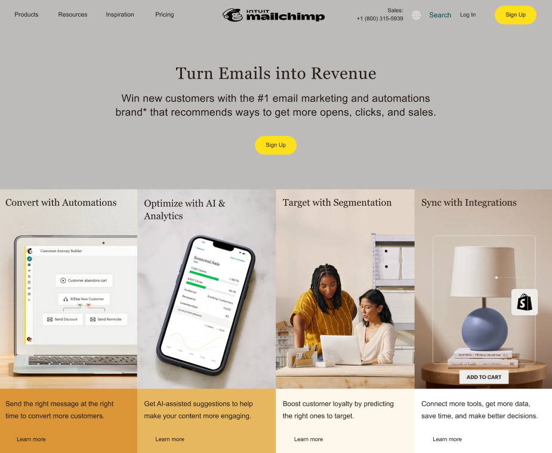
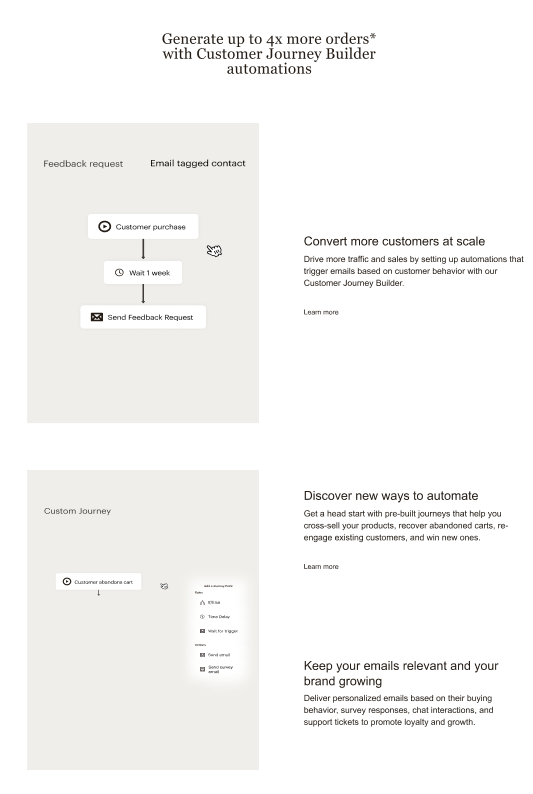
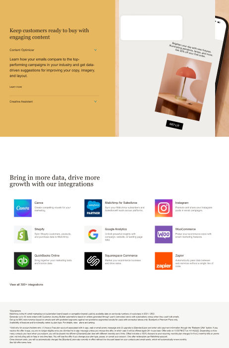
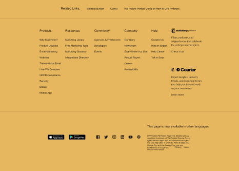

# Exam-Mailchimp-Project

Explore the project here: [Project Demo](https://66098f7acac645dd5c72e396--cheery-fox-91017c.netlify.app/)

## Screenshots

Here are some screenshots of the project:

## Project Overview

This project is a mockup of a Mailchimp email campaign page. It's designed to showcase frontend development skills, including responsive design, HTML, CSS, and JavaScript basics.
